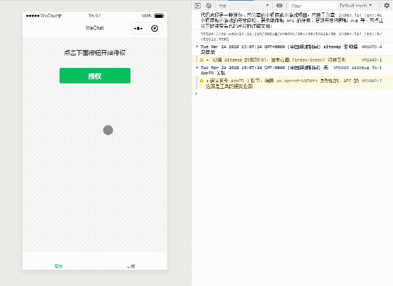

# wechat-app-authorize
微信小程序授权弹窗

获取`userInfo`和`userMobile`

## 说明

1. 当只有`userInfo`或`userMobile`其中一项授权时，会跳过已有授权。例如，已经授权了`userMobile`，则弹窗只会弹出`userInfo`授权；
2. 项目演示内的报错是因为演示小程序未认证，正常流程下不会有这个问题；
3. 如有不足，欢迎指教。

## 项目演示

